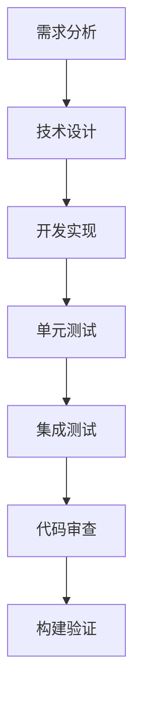
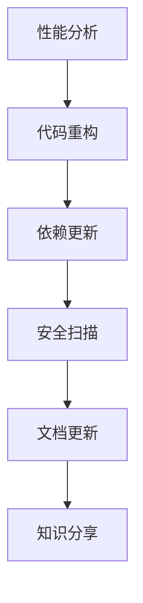
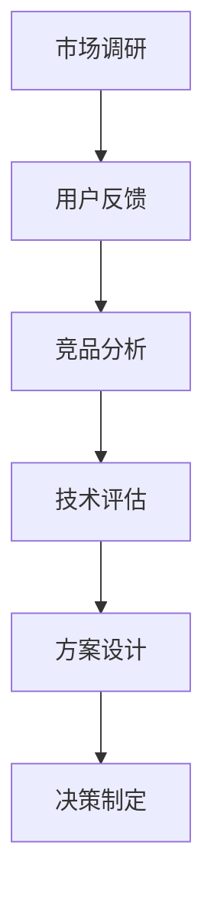
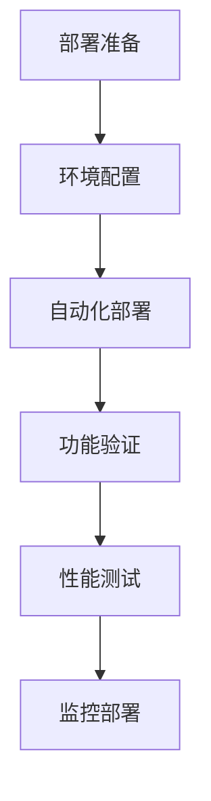

# BMad-Method

BMad-Method (Build-Maintain-Adapt-Deploy Method) 是一套完整的软件工程方法论，专注于现代应用开发的最佳实践。

## 概述

BMad-Method 提供了一个结构化的开发框架，通过四个核心阶段的循环迭代，确保软件项目的高质量交付和持续改进。

## 方法论框架

### 🏗️ Build (构建)
**目标：** 快速构建可工作的软件

- **敏捷开发**：采用 Scrum 或 Kanban 方法
- **测试驱动**：TDD/BDD 确保代码质量
- **持续集成**：自动化构建和测试流程
- **代码审查**：保证代码规范和质量

### 🔧 Maintain (维护)
**目标：** 保持软件的稳定性和可维护性

- **代码重构**：持续改进代码结构
- **性能优化**：监控系统性能并优化
- **安全更新**：及时修复安全漏洞
- **技术债务管理**：平衡新功能和技术改进

### 🔄 Adapt (适应)
**目标：** 快速响应变化需求

- **需求分析**：深入理解用户需求
- **架构演进**：灵活调整系统架构
- **技术选型**：选择合适的技术栈
- **团队学习**：持续提升团队能力

### 🚀 Deploy (部署)
**目标：** 可靠地交付软件到生产环境

- **自动化部署**：CI/CD 管道建设
- **环境管理**：开发、测试、生产环境标准化
- **监控告警**：全方位监控和快速响应
- **回滚机制**：确保部署安全性

## 核心原则

### 1. 快速反馈循环
每个阶段都建立快速反馈机制，确保问题及时发现和解决。

### 2. 持续改进
通过回顾和反思，不断优化流程和方法。

### 3. 团队协作
强调跨职能团队的紧密协作和知识共享。

### 4. 质量优先
在各个阶段都把质量放在首位，确保交付价值。

## 实施指南

### 阶段一：Build (2-4周)


**关键活动：**
- Sprint 规划会议
- 每日站会
- Sprint 评审
- Sprint 回顾

### 阶段二：Maintain (1-2周)


**关键活动：**
- 代码质量评估
- 技术债务识别
- 重构计划制定
- 团队技能培训

### 阶段三：Adapt (1-2周)


**关键活动：**
- 产品路线图调整
- 技术架构升级
- 团队能力建设
- 流程优化

### 阶段四：Deploy (1周)


**关键活动：**
- 发布计划制定
- 部署脚本编写
- 回滚方案准备
- 监控配置

## 工具和模板

### 项目模板
```
project-template/
├── docs/                 # 文档目录
├── src/                  # 源代码
├── tests/                # 测试代码
├── scripts/              # 构建脚本
├── .github/              # CI/CD 配置
└── README.md             # 项目说明
```

### 检查清单
- [ ] 需求文档完整
- [ ] 技术方案评审通过
- [ ] 单元测试覆盖率 > 80%
- [ ] 集成测试通过
- [ ] 性能测试达标
- [ ] 安全扫描通过
- [ ] 部署文档完整
- [ ] 监控配置就绪

## 成功案例

### 电商平台重构
- **Build**: 3周完成核心功能重构
- **Maintain**: 2周性能优化，响应时间减少60%
- **Adapt**: 1周架构调整，支持高并发
- **Deploy**: 1周灰度发布，零故障上线

### 金融系统升级
- **Build**: 4周新功能开发
- **Maintain**: 2周安全加固和合规检查
- **Adapt**: 1周监管要求适配
- **Deploy**: 1周多环境部署，审计通过

## 度量指标

### 开发效率
- 代码提交频率
- 功能交付周期
- 缺陷修复时间
- 代码复用率

### 质量指标
- 缺陷密度
- 代码覆盖率
- 性能基准
- 安全评分

### 团队效能
- 团队满意度
- 知识分享次数
- 技能提升率
- 协作效率

## 常见挑战和解决方案

### 挑战1：需求频繁变更
**解决方案：**
- 建立需求变更控制流程
- 采用敏捷开发方法
- 加强与业务方的沟通

### 挑战2：技术债务积累
**解决方案：**
- 定期技术债务评估
- 制定重构计划
- 平衡新功能和技术改进

### 挑战3：团队技能不足
**解决方案：**
- 制定培训计划
- 引入外部专家
- 建立知识分享机制

## 持续改进

### 定期回顾
- 每个阶段结束后的回顾会议
- 月度方法论评估
- 季度战略调整

### 优化建议
- 收集团队反馈
- 分析项目数据
- 借鉴行业最佳实践

## 资源和支持

### 培训课程
- BMad-Method 基础培训
- 高级实践工作坊
- 认证考试

### 工具支持
- BMad-Tool 工具套件
- 模板库
- 在线协作平台

### 社区资源
- 官方文档和指南
- 社区论坛
- 成功案例库