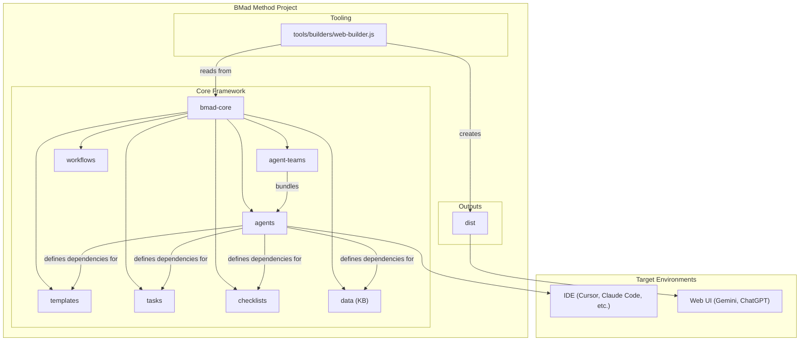
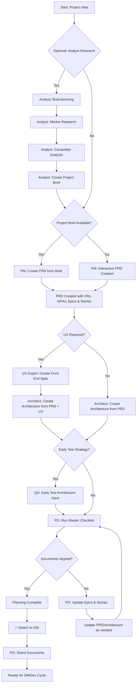
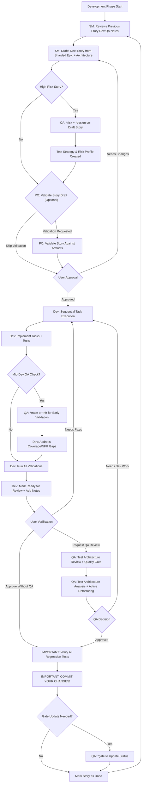

# BMad-Method：突破性敏捷 AI 驱动开发框架

## 项目概述

BMad-Method（Breakthrough Method for Agile AI-Driven Development）是一个革命性的通用 AI 代理框架，专为结构化的 AI 驱动开发而设计。它解决了传统 AI 辅助开发中"氛围编码（vibe coding）"的局限性，通过引入**规范驱动开发**的理念，实现了可预测、可扩展、企业级的 AI 开发工作流程。

> - **项目地址**：[bmad-code-org/BMAD-METHOD](https://github.com/bmad-code-org/BMAD-METHOD)
> - **当前版本**：v4.x 稳定版 | v6-alpha 测试版
> - **GitHub Stars**：19.2k+ | Forks：2.8k+

## 🚀 核心理念：从混乱到有序

### 传统 AI 开发的困境

当前 AI 辅助开发面临的核心问题：

- **不一致性**：依赖非结构化提示，结果质量波动大
- **不可扩展**：小项目尚可，复杂生产级应用容易崩溃
- **黑盒问题**：缺乏治理、可追溯性和架构完整性
- **失控风险**：抽象层次提升导致控制力下降

### BMad 的解决方案

BMad 通过两个核心创新彻底改变这一现状：

#### 1. 智能体规划（Agentic Planning）

专业 AI 代理团队协作创建详细项目规范：
- **分析师（Analyst）**：市场研究、竞争分析、头脑风暴
- **产品经理（PM）**：交互式 PRD 创建和功能规划
- **架构师（Architect）**：系统设计和技术架构
- **UX 专家**：设计决策和用户流程优化

#### 2. 上下文工程开发（Context-Engineered Development）

开发代理获得嵌入任务中的完整项目上下文：
- **消除模糊性**：确保最终代码与初始规范完美对齐
- **结构化工作流**：从需求到实现的系统化方法
- **质量保证**：内置的测试架构和质量门控

## 🛠️ 核心架构设计

### 系统架构图



### 核心组件详解

#### 1. 智能体系统（bmad-core/agents/）

每个智能体都是一个定义明确的 AI 角色：

- **产品负责人（PO）**：Epic 策划和待办事项跟踪
- **Scrum Master（SM）**：票据创建和故事草稿
- **开发者（Dev）**：代码实现和单元测试
- **测试架构师（QA）**：质量门控和代码审查
- **业务分析师（BA）**：需求分析和业务流程

#### 2. 模板处理系统

BMad 的核心优势在于其精密的模板处理架构：

- **template-format.md**：定义标记语言规范，支持变量替换和 AI 处理指令
- **create-doc.md**：文档生成工作流编排引擎
- **advanced-elicitation.md**：交互式优化层，提供 10 种结构化头脑风暴行动

#### 3. 依赖管理系统

每个智能体都有明确的依赖定义：

```yaml
dependencies:
  templates:
    - prd-template.md
    - user-story-template.md
  tasks:
    - create-doc.md
    - shard-doc.md
  data:
    - bmad-kb.md
```

## 🔄 双阶段工作流程

### 阶段一：规划工作流（Web UI）

使用强大的 Web 代理进行成本效益高的规划：



**关键规划产出：**
- **PRD 文档**：完整的产品需求规范
- **架构文档**：系统技术架构设计
- **用户故事**：可执行的开发任务
- **质量计划**：测试策略和风险分析

### 阶段二：核心开发循环（IDE）

切换到 IDE 进行结构化开发：



## 🤖 专业 AI 代理团队

### 完整的敏捷开发团队

BMad 提供完整的 AI 代理团队，覆盖现代软件开发的各个环节：

#### 1. 规划阶段代理

**分析师（Analyst）**
- 市场调研和竞争分析
- 头脑风暴和创意生成
- 项目简报创建

**产品经理（PM）**
- 交互式 PRD 创建
- 功能规划和优先级排序
- 用户故事管理

**架构师（Architect）**
- 系统架构设计
- 技术栈选择
- 集成策略制定

**UX 专家**
- 用户界面设计
- 用户体验优化
- 可用性测试设计

#### 2. 开发阶段代理

**产品负责人（PO）**
- Epic 策划和管理
- 待办事项跟踪
- 冲刺规划

**Scrum Master（SM）**
- 故事草稿创建
- 开发流程协调
- 团队沟通管理

**开发者（Dev）**
- 代码实现
- 单元测试编写
- 技术文档更新

**测试架构师（QA）**
- 测试策略设计
- 质量门控管理
- 代码审查和重构

### 测试架构师的特殊作用

BMad 中的 QA 代理不仅仅是代码审查者，而是具备深度专业知识的**测试架构师**：

#### 核心能力

1. **风险分析（`*risk`）**
   - 识别技术和业务风险
   - 概率×影响分析（1-9 分制）
   - 缓解策略制定

2. **测试设计（`*design`）**
   - 综合测试策略创建
   - 测试级别建议（单元/集成/E2E）
   - 基于风险的优先级排序

3. **需求追溯（`*trace`）**
   - 需求到测试覆盖映射
   - 覆盖缺口识别
   - 可追溯性矩阵生成

4. **非功能需求评估（`*nfr`）**
   - 安全性、性能、可靠性、可维护性验证
   - 基于证据的质量评估

5. **质量门控（`*gate`）**
   - PASS/CONCERNS/FAIL 状态决策
   - 明确的标准和规则
   - 风险接受和豁免管理

## 🎯 质量保证体系

### 质量门控系统

BMad 实施了完整的质量门控体系：

#### 门控状态含义

- **PASS**：所有关键要求满足，无阻塞性问题
- **CONCERNS**：发现非关键问题，团队应审查
- **FAIL**：发现关键问题，应予以解决
- **WAIVED**：问题已知但被团队明确接受

#### 测试质量原则

- **无不稳定测试**：确保可靠性
- **无硬等待**：动态等待策略
- **无状态且并行安全**：测试独立运行
- **自清理**：测试管理自己的测试数据
- **适当的测试级别**：单元测试逻辑，集成测试交互
- **明确断言**：断言保留在测试中

### 技术偏好系统

BMad 包含个人化系统，通过 `technical-preferences.md` 文件：

```yaml
# 技术栈偏好
preferred_stack:
  frontend: React/Vue
  backend: Node.js/Python
  database: PostgreSQL/MongoDB

# 设计模式偏好
preferred_patterns:
  - Repository Pattern
  - Dependency Injection
  - Observer Pattern

# 反模式列表
anti_patterns:
  - God Object
  - Spaghetti Code
  - Copy-Paste Programming
```

## 🚀 快速开始指南

### 安装方式

#### 一键安装（推荐）

```bash
npx bmad-method install
```

这会自动处理：
- 新项目安装
- 现有项目升级
- 扩展包安装

#### 手动安装

```bash
git clone https://github.com/bmadcode/bmad-method.git
npm run install:bmad
```

### Web UI 快速部署

1. **获取团队包**：保存 `dist/teams/team-fullstack.txt`
2. **创建 AI 代理**：创建 Gemini Gem 或 CustomGPT
3. **上传配置**：上传文件并设置指令
4. **开始规划**：使用 `*help` 查看可用命令

### IDE 集成

BMad 支持主流的 AI 编码环境：

- **Cursor**：使用 `@` 符号调用代理
- **Claude Code**：使用斜杠命令 `/agent`
- **OpenCode**：通过 `opencode.jsonc` 配置
- **Windsurf**：支持手动规则集成

## 🌐 应用场景与价值

### 企业级应用

#### 治理和合规性
- **可追溯性**：完整的需求到实现追溯链
- **标准化**：一致的开发流程和质量标准
- **审计支持**：完整的文档和决策记录

#### 团队协作
- **统一语言**：规范的 PRD 和架构文档
- **角色清晰**：明确的代理职责和协作流程
- **知识管理**：结构化的项目知识库

### 个人开发者

#### 效率提升
- **快速原型**：结构化的快速 MVP 开发
- **质量保证**：内置的测试和质量检查
- **学习辅助**：最佳实践和模式指导

#### 技能发展
- **架构思维**：系统化的架构设计训练
- **项目管理**：完整的软件开发生命周期体验
- **代码质量**：专业级的代码审查和重构

## 🎓 扩展生态系统

### 扩展包系统

BMad 的自然语言框架适用于任何领域：

- **创意写作**：故事创作和编辑扩展包
- **商业策略**：商业计划和市场分析扩展包
- **健康养生**：健康管理和生活方式扩展包
- **教育培训**：课程设计和学习管理扩展包

### 技术扩展包

- **游戏开发**：Unity/Unreal 开发工作流
- **DevOps**：基础设施和部署自动化
- **移动开发**：iOS/Android 原生开发
- **数据科学**：机器学习和数据分析项目

## 🔮 未来发展方向

### v6 Alpha 版本

当前正在开发的 v6 版本代表了重大架构升级：

- **完整重写**：显著的架构变更
- **实验性功能**：早期采用者专享
- **持续更新**：日常更新和不稳定性
- **官方测试**：2025年10月中旬合并测试版

### 社区生态

- **活跃社区**：Discord 社区和 GitHub 讨论
- **持续贡献**：开源贡献者和扩展包开发者
- **知识分享**：YouTube 教程和技术博客
- **企业采用**：越来越多的企业级应用案例

## 🏆 总结：AI 开发的范式转变

BMad-Method 代表了 AI 辅助开发的重大范式转变：

### 核心价值主张

1. **结构化优于混乱**：从非结构化提示到规范驱动开发
2. **团队协作替代单兵作战**：完整的 AI 代理团队协作
3. **质量内建而非事后检查**：全生命周期的质量保证
4. **可预测性替代随机性**：企业级的可预测和可扩展开发

### 对不同用户的价值

**对企业：**
- 降低 AI 开发风险
- 提高开发效率和代码质量
- 满足合规和治理要求
- 建立标准化的开发流程

**对开发团队：**
- 提供清晰的工作流程和质量标准
- 减少沟通成本和认知负担
- 加速新成员上手和知识传递
- 提升团队整体技术能力

**对个人开发者：**
- 学习企业级的软件开发实践
- 提高个人项目质量和可维护性
- 掌握结构化的开发方法论
- 增强在 AI 时代的竞争力

BMad-Method 不仅是一个工具集，更是一种全新的开发哲学。它通过将软件工程的最佳实践与 AI 的强大能力相结合，开创了 AI 时代软件开发的新范式，让开发者能够在保持控制力的同时，充分利用 AI 带来的效率提升。
